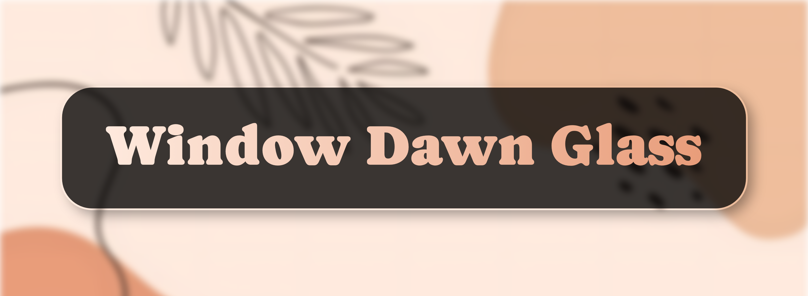
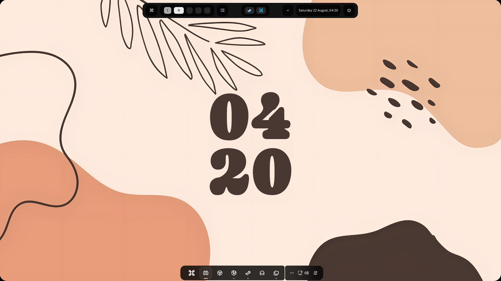

# Windows Minimalistic Theme — Komorebi Rice

<p align="center">
  
</p>

A Windows desktop rice built around [komorebi](https://github.com/LGUG2Z/komorebi) tiling window manager, with [YASB](https://github.com/amnweb/yasb) as the status bar, Windhawk for shell tweaks, [tacky-borders](https://github.com/lukeyou05/tacky-borders) for window borders, and [Rainmeter](https://github.com/rainmeter/rainmeter) for extras.

This one is mostly a variant from another rice I did called Windows Dawn Theme. Let me know what you think!

> **Note:** A one-click installer script is planned for a future release. Windows makes scripted dotfile installs annoying (no native symlink/config convention like Linux), so for now installation is manual. If someone wants to contribute a script, I'd be happy to merge it!

## Preview

<p align="center">
  
</p>

## What's Included

| Folder | What it is |
|---|---|
| `fastfetch/` | Terminal system-info logo used in showcase screenshots |
| `komorebi/` | Tiling window manager config |
| `rainmeter/` | Rainmeter skin(s) |
| `tacky-borders/` | Custom window border styling |
| `walls/` | Personal wallpaper collection (use Default for this one)|
| `windhawk/` | Windhawk mod configs (text-based, see below) |
| `yasb/` | Status bar config |

## Installation

### fastfetch
Copy the `fastfetch` folder into your `.config` directory:
```
C:\Users\<your_name>\.config\
```

### komorebi
Same as above — goes in:
```
C:\Users\<your_name>\.config\
```

### tacky-borders
Same as above — goes in:
```
C:\Users\<your_name>\.config\
```

### rainmeter
A bit different since Rainmeter doesn't use `.config`:
1. Open Rainmeter, right-click any existing skin → **Open Skin Folder**
2. Copy this repo's `rainmeter` folder into the **parent** directory of that folder (i.e. your main Rainmeter skins folder, not a specific skin's folder)

### P.S. rainmeter
Recommended way to install this config for the clock is to install JaxCore (deprecated, but still awesome):
1. This is the link for the rainmeter installer, you can select which modules to install: https://jaxcore.app/
2. The one module I've used in this config is 'ModularClocks'
2. Make sure to support them or try out some modules that weren't used in this config
3. After selecting ModularClocks, open the settings for it and type in 'Sitewalk' or 'JetBrainsMono NFP' fon
4. After selecting the font, right click on the widget itself on the desktop and click 'Align' -> 'Center'

Tip: Also right click again and click 'Change Z Layer', then select 'Move to layer -2'

### windhawk
These are text configs, not files to copy:
1. Install the mod named in each folder from the Windhawk mod store
2. Open the mod's settings page
3. Switch to **Textual mode**
4. Paste in the contents of the corresponding file from `windhawk/`

> Wishlist: it'd be great if Windhawk supported importing a folder as a backup/config source directly, instead of copy-pasting text.

### yasb
Copy the `yasb` folder into `.config` as well.

⚠️ **Heads up:** the included config was built for a **multi-monitor** setup. If it doesn't behave correctly on a single monitor, please [open an issue](../../issues) and I'll get it fixed.

### walls
Just a personal wallpaper collection, drop into wherever you keep your wallpapers. Got a cool wallpaper you think fits the vibe? Feel free to suggest it via issue or PR.

### File Pilot - File Explorer Alternative
Not required, but used in the showcase as a faster alternative to Windows Explorer.
Download it from [filepilot.tech](https://filepilot.tech/download).

## Fonts

Pulled from `styles.css`, install these or YASB widgets will fall back to a default font and look off.

**Nerd Fonts** ([get them here](https://www.nerdfonts.com/font-downloads)):
- `JetBrainsMono Nerd Font` (Propo variant) — used for most widget labels, keybind popups, systray
- `ProFontWindows Nerd Font` — used on the clock widget

**Google Fonts** ([get them here](https://fonts.google.com)):
- `Inter` — clock label, active window title

**Other:**
- `SN Pro` — workspace widget labels ([free download](https://fontsgeek.com/fonts/SN-Pro-Regular))
- `Segoe UI` — ships with Windows, no install needed
- 'Sitewalk' - doesn't ship with Windows and it's for the rainmeter clock, but you can use 'JetBrainsMono NFP' as a fallback

After installing, restart YASB for the fonts to apply.

## Feedback

This is very much a living project. If you:
- Get it working, let me know how it comes together!
- Have suggestions/improvements
- Have wallpapers to contribute
- Hit a bug (especially with `yasb` on single-monitor setups)

...please open an issue if there are any issues .

## Roadmap

- [ ] Open-source installer script (Windows-side scripting is the current blocker)
- [ ] Folder-import support for Windhawk configs (upstream feature request)
- [ ] More wallpaper variety

## License
MIT — see LICENSE for details.
